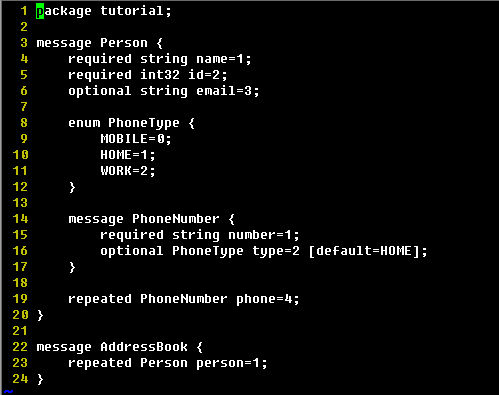
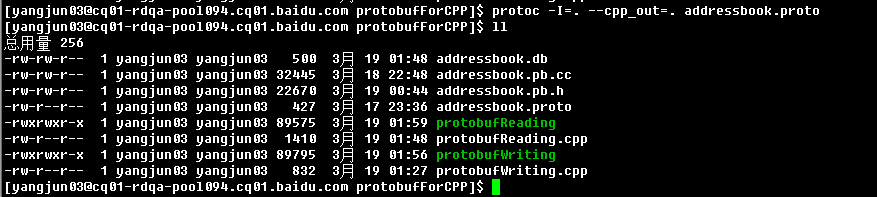
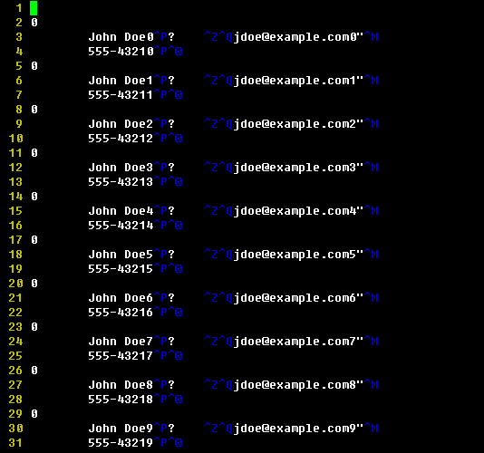
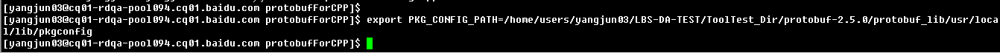
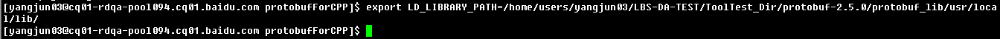
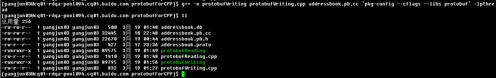
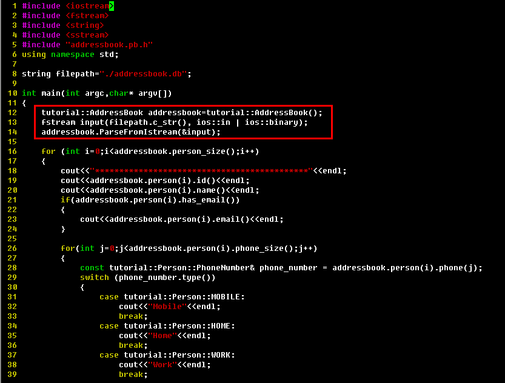
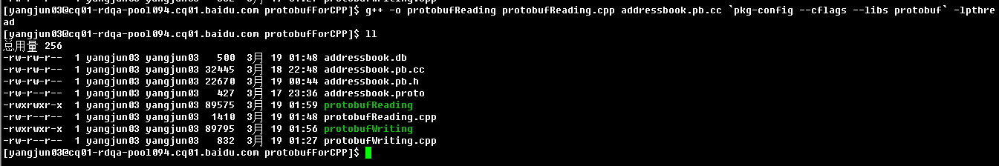
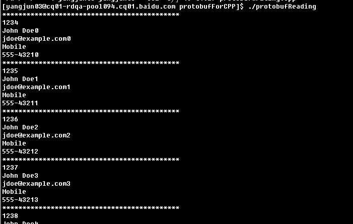

protobufForCPP
==============

### Introduction:
an example of google ptotobuf for reading and writing with cpp.the project is still being planned and in development stage,please pay attention to continuous update follwed-up.    

### Feature:
* example of proto file definition.
* example of proto file compile to cpp file.
* example of protobuf writing from cpp object to bytes stream.
* example of protobuf reading from bytes stream to string or cpp object.

### UpdateRecords:
* 1.0——base version.

### Dependencies:
* protobuf=>>http://code.google.com/p/protobuf/

### Screenshots:    
**1.screenshot of proto file definition:**    

**2.screenshot of proto file compile:**    

**3.screenshot of data writing:**    
    

**4.screenshot of compiler configue:**    

**5.screenshot of dll configue:**    

**6.screenshot of data writing compile:**    

**7.screenshot of data writing result:**    

**8.screenshot of data reading:**    

**9.screenshot of data reading compile:**    

**10.screenshot of saved data file reading and parse:**    

### Kindly Reminder:
If any questions, please contact JunneYang 597092663@qq.com.
